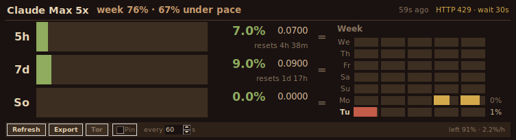

# Claude Usage Monitor

**See exactly how much of your Claude Pro/Max limits you've used, _before_ you hit the wall.**

A tiny, local desktop widget (and CLI) that reads the login token Claude Code
already stores on your machine and shows your **5-hour** and **7-day** usage
windows as live bars, with a **7-day heatmap** and "resets in…" countdowns. No
account to create, no server, no telemetry. The only network call is to
Anthropic's own API.



> Single Python file · **zero pip dependencies** (standard library + Tkinter) · MIT.

---

## Why this exists

If you lean on Claude Code or a Claude Pro/Max subscription, you know the
feeling: you kick off a big refactor or a long agent run, and mid-flow you
hit a rate limit. Claude only tells you you're capped *after* it happens, and
the message is a vague "resets in N hours." You can't see it coming, you can't
tell whether it's the **5-hour** or the **7-day** window that's the bottleneck,
and you have no idea how much headroom is left before kicking off something
expensive.

This widget fixes that one small, recurring annoyance:

- **See it before you hit it.** A glanceable bar shows how close you are to each
  limit *right now*, so you can decide whether to start that big task or wait for
  a reset.
- **Know which window is the constraint.** The 5-hour and 7-day limits are
  tracked separately (plus the Sonnet-specific weekly limit on Max), so you know
  what's actually holding you back.
- **Learn your own rhythm.** The 7-day heatmap quietly builds a picture of when
  you burn the most, so you can pace yourself across the week.
- **Don't get blindsided.** It rides out Anthropic's occasional IP rate-limiting
  with automatic backoff and an optional Tor fallback, and restores your last
  reading instantly on restart, so the bars are never blank.

It's deliberately small, a single file you can read in one sitting, and it
stays out of your way: a quiet bar in the corner that turns yellow, then red, as
you approach a limit.

## Features

- **5h / 7d / Sonnet bars** with green → yellow → red color coding.
- **Weekly heatmap.** The peak of each 5-hour block for the last 7 days, plus
  each day's contribution to your 7-day window. Builds up the longer you run it.
- **Weekly pace tracker.** Compares how much of your 7-day budget you've used
  against how much of the week has elapsed, so you can see at a glance whether
  you're *over pace* (on track to run out early) or *under pace* (budget to
  spare). It also shows how much you can spend per hour to use it all by the reset.
- **Live countdowns** to each window reset.
- **Resilient polling.** Exponential backoff on `HTTP 429`, instant restore of
  the last reading on restart (so the bars are never blank).
- **Optional Tor fallback.** Anthropic occasionally IP-rate-limits the usage
  endpoint. If you have Tor running, the widget can automatically route the
  request over a fresh exit IP (or you can toggle it by hand). Entirely
  optional; ignored if Tor isn't installed.
- **CLI mode.** `claude-usage status` prints your usage to the terminal, handy
  for scripts, prompts, or headless boxes.
- **Exportable usage log.** Every change is logged locally, so history builds
  up the longer it runs. Export the full time series to **Markdown** or **CSV**
  (opens in Excel) from the **Export** button or `claude-usage export`.

## Pacing your weekly budget

The 7-day window is the one that quietly bites. It resets only once a week, so
it helps to know whether you're spending it evenly. The widget answers that:

- The header shows **how much of the week has elapsed** next to a one-glance
  verdict: **on pace**, **under pace** (you have surplus), or **over pace**
  (you'll hit the cap before it resets).
- The control bar shows **how much budget is left** and a **per-hour figure**,
  how much you can spend each remaining hour to finish at exactly 100% by reset.
- `claude-usage status` spells it out in full:

  ```text
  Week:    75% elapsed · 6% used · 94% left
  Pace:    69% under pace · 0.08x burn rate
  Budget:  ~2.2%/h to use it all by reset (42h left)
  ```

The **burn rate** is just `used ÷ elapsed`: `1.0x` is exactly on pace, below
`1.0x` means you're spending your weekly budget slower than the clock (room to
spare), and above `1.0x` means you're burning it faster than the week and will
run dry early if you keep that pace.

## Requirements

- **Python 3.9+**
- **Tkinter** for the widget. It ships with python.org builds; on Debian/Ubuntu:
  `sudo apt install python3-tk`. (The `status` / `login` CLI commands work
  without it.)
- A **Claude Pro or Max** subscription, logged in once via
  [Claude Code](https://www.claude.com/product/claude-code). The widget reuses
  that login. It never asks for your password, and stores no credentials of its
  own.
- *(Optional)* `tor` + `torsocks` + `curl` for the Tor fallback.

## Setup

It reads the OAuth token Claude Code saves at `~/.claude/.credentials.json`. So:

1. Install [Claude Code](https://www.claude.com/product/claude-code) and run
   `claude` once, logging in with your Claude account.
2. Install this tool (pick one):

   ```bash
   # Option A: run the single file directly
   git clone https://github.com/Corread8/claude-usage-monitor
   cd claude-usage-monitor
   python3 claude_usage.py login      # confirms it found your account

   # Option B: install the `claude-usage` command with pipx
   pipx install git+https://github.com/Corread8/claude-usage-monitor
   claude-usage login
   ```

3. `login` prints your plan and live usage to confirm everything works. Then:

   ```bash
   claude-usage          # launch the widget
   ```

That's it. No config file required.

## Usage

| Command | What it does |
| --- | --- |
| `claude-usage` | Launch the desktop widget (default). |
| `claude-usage login` | Detect your account, validate the token, print live usage. |
| `claude-usage status` | Print current usage once and exit (no window). |
| `claude-usage export md\|csv [path]` | Export the recorded usage log to Markdown or CSV. |

In the widget:

- **Refresh.** Poll now.
- **Export.** Save your usage log to Markdown or CSV.
- **Tor.** Toggle routing over Tor (disabled if Tor isn't available).
- **Pin.** Keep the window on top.
- **every N s.** Polling interval, 30 to 900 seconds.

### Run it on login (Linux)

Copy the desktop entry and adjust the path:

```bash
cp claude-usage.desktop ~/.local/share/applications/
# edit Exec= to point at your checkout, or to the pipx-installed `claude-usage`
```

## Export your usage log

The widget keeps an append-only log of every *changed* reading at
`~/.config/claude-usage-monitor/usage_log.jsonl`. The longer it runs, the
more history you accumulate. Export it any time:

- In the widget, click **Export** → choose **Markdown (.md)** or **CSV (.csv)**
  and where to save it.
- From the terminal:

  ```bash
  claude-usage export md            # → ./claude-usage-<date>.md
  claude-usage export csv out.csv   # CSV opens directly in Excel / LibreOffice
  ```

Each row is a timestamped reading: plan, 5h %, 7d %, Sonnet %, the window reset
times, and status. You can chart your usage over weeks, or audit exactly when
you hit a limit.

## How it works

```
~/.claude/.credentials.json   ──read──▶  claude-usage
        (Claude Code's token)                │
                                             ├─▶ GET https://api.anthropic.com/api/oauth/usage
                                             │     Authorization: Bearer <token>
                                             │     anthropic-beta: oauth-2025-04-20
                                             │
                                             └─▶ five_hour / seven_day / seven_day_sonnet
                                                   utilization + reset times → bars + heatmap
```

History, the last reading, and the usage log live under
`~/.config/claude-usage-monitor/` (honors `$XDG_CONFIG_HOME`), with `0600`
permissions.

## Privacy & security

- **Local-only.** No server, no analytics, no phone-home. The only outbound
  request is to Anthropic's own API, with the token Claude Code already stored.
- **No credentials of its own.** It reads the existing token; it never writes,
  refreshes, or transmits it anywhere except to Anthropic.
- If the stored token has expired, open Claude Code (`claude`) to refresh it.
  This tool deliberately doesn't manage your login.

## Limitations & notes

- The usage endpoint is an **unofficial** Anthropic endpoint used by Claude
  Code; Anthropic may change it without notice. If the numbers stop updating,
  check for an update here.
- Plan detection (Pro / Max 5x / Max 20x) comes from your stored credentials.
  Override it if needed by creating
  `~/.config/claude-usage-monitor/config.json` → `{"plan": "max_20x"}`.
- The percentages shown are Anthropic's own utilization figures, and this tool
  doesn't estimate token counts (those would only be guesses).

## License

MIT. See [LICENSE](LICENSE).

---

*Not affiliated with or endorsed by Anthropic. "Claude" is a trademark of
Anthropic. This is an independent, unofficial utility.*
